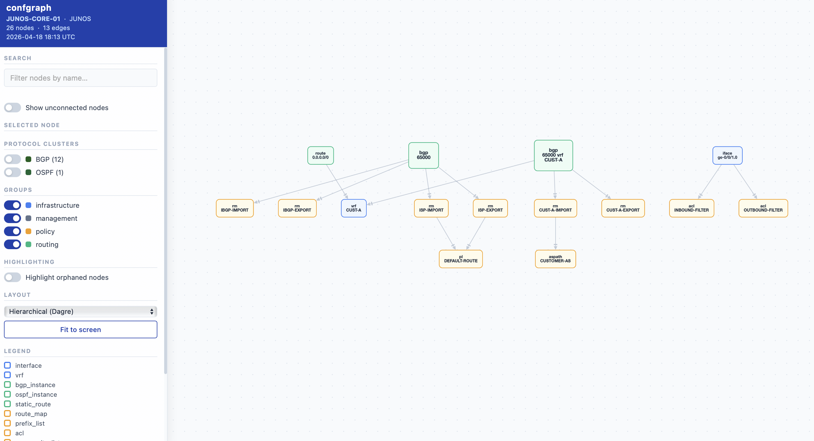

# confgraph

Network configs are text files. The dependencies between them are a graph. confgraph makes the blast radius visible and human error avoidable.

```bash
uvx confgraph map router.txt
```



## What it does

Point it at a config file. It parses every protocol, builds a dependency graph, and exports a self-contained interactive HTML file you can open in any browser.

```bash
uvx confgraph map router.txt --output-dir .
open router.html
```

## Why this matters

**Reducing Cognitive Load.** Most engineers navigate configs with grep — find the prefix-list, grep for the route-map, grep for the BGP neighbor. That's a 5-step mental join query just to understand one dependency. confgraph replaces it with a single glance, so you can focus on logic rather than navigation.

**Preventing Human Error.** An engineer deletes an ACL that looks unused. Ten minutes later they realize it was the only thing protecting the management plane on a different VRF. In a graph, that ACL is visibly connected — you can see what you're about to break before you break it.

**Ghost configuration.** Large enterprise configs accumulate ghost objects: prefix-lists nobody calls, route-maps that reference non-existent ACLs. In a CLI they look like valid config. In a graph they appear as disconnected nodes — making confgraph a clean-up tool, not just a visualization tool.

**High Blast Radius Dependency Mapping.** When a shared policy object — an ACL used by both NAT and BGP, or a community list referenced across multiple neighbors — gets modified, the effects ripple unpredictably. confgraph surfaces these high blast radius objects so architects can trace the full directional flow before touching anything. The conversation shifts from "I think it affects these three neighbors" to "I can see it does."

## Designed for troubleshooting

confgraph doesn't dump nodes on a screen — it clusters by protocol domain. Infrastructure, Routing, Policy, QoS, Security, and Management objects are grouped so the parts of the config that work together stay together visually.

Troubleshooting a BGP flap? The BGP cluster automatically pulls in related route-maps and prefix-lists, creating a logical island of the entire prefix path from neighbor to policy to filter.

**Focused root cause analysis.** Select any node to instantly isolate its direct dependencies. See exactly which interfaces are tied to a VRF, which policies are affecting a routing instance, or which ACLs a NAT rule depends on — without scrolling through thousands of lines of config.

## Supported platforms

| OS | Parser |
| --- | --- |
| Cisco IOS / IOS-XE | `IOSParser` |
| Cisco IOS-XR | `IOSXRParser` |
| Cisco NX-OS | `NXOSParser` |
| Arista EOS | `EOSParser` |
| Juniper JunOS | `JunOSParser` |
| Palo Alto PAN-OS | `PANOSParser` |

## Try it instantly

Pre-generated maps for all supported platforms — open any in your browser, no install needed:

| Platform | Sample config | Interactive map |
| --- | --- | --- |
| Cisco IOS | [samples/ios.txt](samples/ios.txt) | [Live demo](https://verigraphs.github.io/confgraph/samples/ios.html) |
| Cisco IOS-XE | [samples/ios_xe.txt](samples/ios_xe.txt) | [Live demo](https://verigraphs.github.io/confgraph/samples/ios_xe.html) |
| Cisco IOS-XR | [samples/ios_xr.txt](samples/ios_xr.txt) | [Live demo](https://verigraphs.github.io/confgraph/samples/ios_xr.html) |
| Cisco NX-OS | [samples/nxos.txt](samples/nxos.txt) | [Live demo](https://verigraphs.github.io/confgraph/samples/nxos.html) |
| Arista EOS | [samples/eos.txt](samples/eos.txt) | [Live demo](https://verigraphs.github.io/confgraph/samples/eos.html) |
| Juniper JunOS | [samples/junos_test.cfg](samples/junos_test.cfg) | [Live demo](https://verigraphs.github.io/confgraph/samples/junos_test.html) |
| Cisco IOS (full) | [samples/ios01.txt](samples/ios01.txt) | [Live demo](https://verigraphs.github.io/confgraph/samples/ios01.html) |
| Palo Alto PAN-OS | [samples/panos_sample.xml](samples/panos_sample.xml) | [Live demo](https://verigraphs.github.io/confgraph/samples/panos_sample.html) |

## Install

Requires [pip](https://packaging.python.org/en/latest/tutorials/installing-packages/):

```bash
pip install confgraph
```

Or run without installing via [uv](https://docs.astral.sh/uv/getting-started/installation/#homebrew):

```bash
uvx confgraph map router.txt
```

## Protocols parsed

**BGP** · **OSPF** · **ACLs** · **NAT** · **Crypto/IPsec** · VRF · IS-IS · EIGRP · RIP · Route-maps · Prefix-lists · Community lists · AS-path lists · Static routes · NTP · SNMP · Syslog · Banners · QoS · BFD · IP SLA · EEM · Object tracking · Multicast · Security zones (PAN-OS)

## Use as a library

```python
from confgraph.parsers.ios_parser import IOSParser

parsed = IOSParser(open("router.txt").read()).parse()
print(parsed.bgp_instances)
print(parsed.route_maps)
```

## Security & Privacy

**Local-first by design.** confgraph never sends your config files anywhere. All parsing, graph generation, and analysis run entirely on your machine. The output is a single self-contained HTML file with no external requests — no CDN, no analytics, no telemetry. This means it can be safely moved to and used within air-gapped management jump-hosts where internet access is prohibited.

## CLI Reference

See [`docs/CLI_USAGE.md`](docs/CLI_USAGE.md) for all commands, options, and examples.

## Contributing

Contributions welcome — new parsers, bug fixes, additional protocol coverage. See [`docs/ARCHITECTURE.md`](docs/ARCHITECTURE.md) to get started.

## License

Apache 2.0
